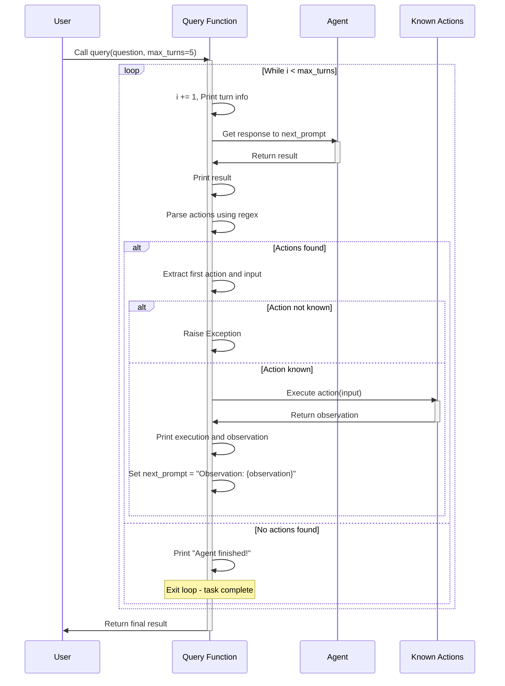

# ReAct Agent Flow Diagram

This diagram illustrates the ReAct (Reasoning + Acting) agent flow from Tutorial_02_agent.ipynb, showing how the agent processes customer support queries through a loop of Thought, Action, and Observation.

## Agent Architecture

The ReAct agent follows this pattern:

1. **Thought**: Reasons about what to do
2. **Action**: Decides an action to take  
3. **Observation**: Receives result from action
4. **Repeat**: Continues until task is complete

## Available Actions

- `calculate`: Performs mathematical calculations
- `get_customer_info`: Retrieves customer details by ID
- `get_ticket_status`: Checks support ticket information by ID

## Flow Diagram

## Use Case: Customer Support Ticketing System

The agent helps manage customer support queries by:

- Looking up customer information using customer IDs
- Checking ticket statuses and details
- Performing calculations when needed
- Combining multiple data sources to provide comprehensive answers

## Example Scenarios

1. **Simple Query**: "What is the status of ticket TKT98765?"
2. **Complex Query**: "Get me the details for customer CUST12345 and their ticket TKT98765"
3. **Calculation**: "If we have 15 high priority tickets and 23 medium priority tickets, what's the total?"
4. **Multi-step**: "Customer CUST11111 has 3 open tickets and customer CUST67890 has 5 open tickets. What's their combined ticket count?"
